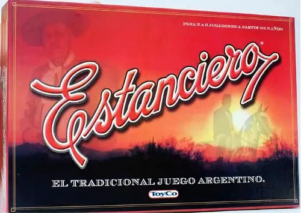

### EL ESTANCIERO, THE GAME

I am proud to present "The Estanciero," a digital adaptation of the classic Argentine board game. "El Estanciero" is
similar to Monopoly, where players buy and trade properties, develop them with houses and hotels, and collect rent from
their opponents, aiming to bankrupt them. This project was a collaborative effort, showcasing our ability to work as a
cohesive team to bring a traditional game to the digital platform.

**Technologies Used:**
- Lucidchart
- Trello
- Java
- Hibernate (ORM)
- H2 (Database)
- Maven (Build Automation)
- IntelliJ IDEA (IDE)

**Key Features:**

- **Player Movement:** Players can move between boxes, replicating the mechanics of the traditional board game.
- **Turn Management:** Dynamic turn management to ensure smooth gameplay transitions.
- **Game State Management:** Robust system for handling player actions and maintaining game states.
- **User Interface:** User-friendly interfaces and interactive elements to enhance the player experience.
- **Data Persistence:** Efficient database management with Hibernate to ensure game data is consistently saved and
  retrieved.

In this project, we focused on faithfully replicating the core mechanics of the game, ensuring an engaging and authentic
experience for players. Our team successfully combined our individual skills in software development to create a
seamless and enjoyable digital version of "El Estanciero."

This project highlights our collective skills in software development and teamwork.

