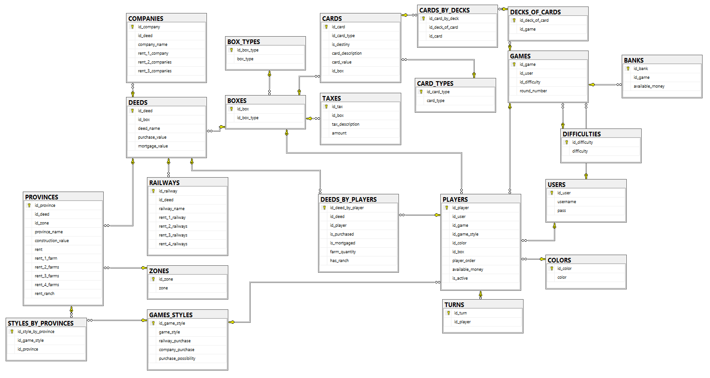

# **EL ESTANCIERO**
_TPI-LAB III---GRUPO 4_

---

## Cosigna

**Semana 1:** Entregar un documento en formato markdown en el repositorio, en
la carpeta /docs, con todas las clases base detectadas como necesarias para
resolver el problema, con sus atributos, métodos y responsabilidades.
Entregar un modelo DER con todas sus entidades completas.

## Herramientas tecnológicas utilizadas
Las herramientas y aplicaciones tecnológicas utilizadas para este proyecto son:

- Googl Docs
- Lucid.app
- Discord
- Git y GitHub

## Definición de Clases:
El proyecto está compuesto por XX clases, detalladas a continuación:

### **1. User class**

| ATRIBUTOS                 | METODOS           |
|---------------------------|-------------------|
| - idUser                  | + login()         |
| - username                | + logout()        |
| - password                | + register()      |

### **2. Game Class**
| ATRIBUTOS              | METODOS           |
|------------------------|-------------------|
| - idGame               | + startGame()     |
| - Dashboard: Dashboard | + incrementRound()|
| - roundNumber          | + saveGame()      |
| - players: Player[]    | + endGame()       |
| - difficulty           |                   |

### **3. StyleGame Class**
| ATRIBUTOS                  | METODOS           |
|----------------------------|-------------------|
| - idStyleGame              |                   |
| - possibilityPurchase      |                   |

### **4. Difficulty Class**
| ATRIBUTOS                  | METODOS           |
|----------------------------|-------------------|
| - idDifficulty             |                   |
| - difficulty               |                   |

### **5. Player Class**
| ATRIBUTOS                  | METODOS           |
|----------------------------|-------------------|
| - idPlayer                 | + buy()           |
| - moneyAvailable           | + receive()       |
| - idUser                   | + rest()          |
| - StyleGame : StyleGame    | + lose()          |
| - Deed: Deed[]             | + negotiate()     |
| - isActive                 |                   |
| - position                 |                   |

### **6. Dashboard Class**
| ATRIBUTOS                  | METODOS           |
|----------------------------|-------------------|
| - idDashboard              | + paintBoxes()    |
| - boxes: Box[]             |                   |

### **7. Dice  Class**
| ATRIBUTOS                  | METODOS           |
|----------------------------|-------------------|
| - idDice                   | + getValues()     |
|                            | + areEqual()      |

### **8. Bank Class**
| ATRIBUTOS                  | METODOS           |
|----------------------------|-------------------|
| - idBank                   | + buy()           |
| - moneyAvailable           | + receive()       |

### **9. Box Class**
| ATRIBUTOS   | METODOS           |
|-------------|-------------------|
| - idBox     | + activateCheck() |
| - boxNumber |                   |
| - BoxType   |                   |

### **10. Card Class**
| ATRIBUTOS                  | METODOS           |
|----------------------------|-------------------|
| - idCard                   | + pay()           |
| - CardType                 | + receive()       |
| - description              | + payByProperty() |
|                            | + payByPlayer()   |
|                            | + movePlayer()    |

### **11. Deed Class**
| ATRIBUTOS                  | METODOS           |
|----------------------------|-------------------|
| - idDeed                   | + getRent()       |
| - name                     |                   |
| - purchaseValue            |                   |
| - rentalValue              |                   |
| - mortgageValue            |                   |
| - isPurchased              |                   |
| - isMortgage               |                   |

### **12. Province: Deed Class**
| ATRIBUTOS                  | METODOS           |
|----------------------------|-------------------|
| - idProvince               | + getRent()       |
| - quantityFarm             |                   |
| - hasRanch                 |                   |
| - zone                     |                   |
| - constructionValue        |                   |

### **13. Company: Deed Class**
| ATRIBUTOS                  | METODOS           |
|----------------------------|-------------------|
|                            |                   |

### **14. Railway: Deed Class Class**
| ATRIBUTOS                  | METODOS           |
|----------------------------|-------------------|
|                            |                   |

---
## Diagrama Entidad Relacion

Comenzamos por la tabla juegos la cual tiene la información de la dificultad y el usuario que creo esa partida. De ahí partimos hacia los jugadores, los cuales pertenecen a un juego en particular, un color, un orden, un estilo de juego en particular y el id del usuario en caso de corresponder. Estos jugadores pueden poseer una cierta cantidad de escrituras que son almacenadas en la tabla ESCRITURAS_X_JUGADORES la cual además guarda información sobre las mejoras realizadas en dicha propiedad. También los jugadores se posicionan en casillas las cuales, en la tabla JUGADORES_X_CASILLAS se almacena la posición de los jugadores de un juego en particular para así poder cargarlos en caso de que el jugador reanude una partida que no termino. Los jugadores, si son bots, tendrán un id de estilo de juego el cual almacena los parámetros que determinan sus comportamientos como pueden ser las provincias que desean comprar, si compra ferrocarriles o no o la probabilidad de que el bot realice una mejora en su turno.
En el juego existen casillas que pueden ser de diferentes tipos, como pueden ser impuestos, premios, tarjetas, cárcel y propiedades, para ello se existe un tipo para las casillas y tablas que almacenan aquellos datos necesarios para las casillas. La más compleja de todas ellas son las escrituras las cuales representan a provincias, empresas y ferrocarriles. Estos tres comparten cierta información, su valor de compra y de hipoteca, su nombre y un id de casilla. Luego hay información que no se comparte, en el caso de empresas y ferrocarriles los valores de sus alquileres son estáticos*, por lo que no se crearon tablas para almacenarlos. en el caso de las provincias existe mucha información que se diferencia de las empresas y ferrocarriles, como el valor de construcción de mejora, las zonas y los diferentes alquileres.
Para cerrar, se creó una clase mazo para relacionar el mazo de tarjetas de destino y suerte son las tarjetas.

